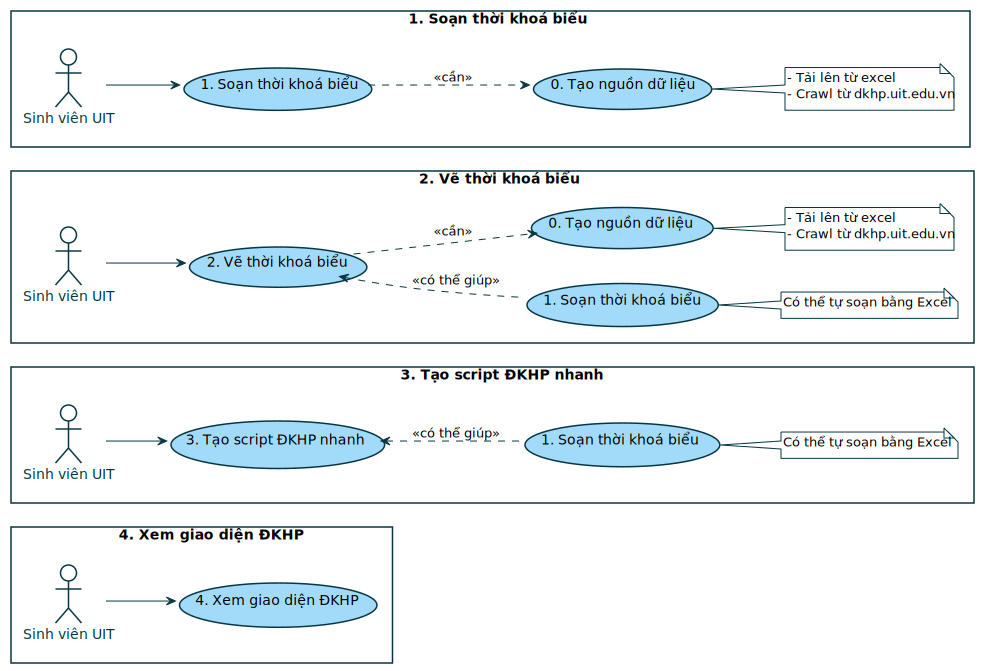
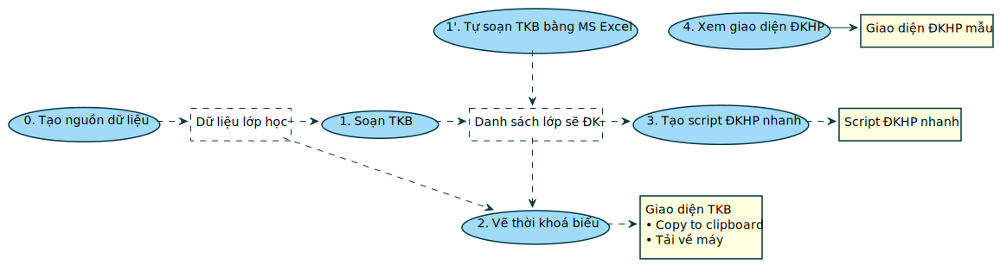
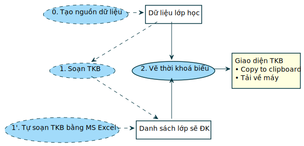
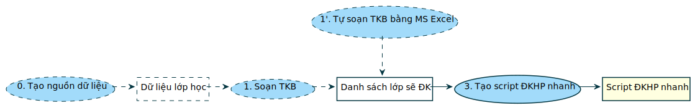
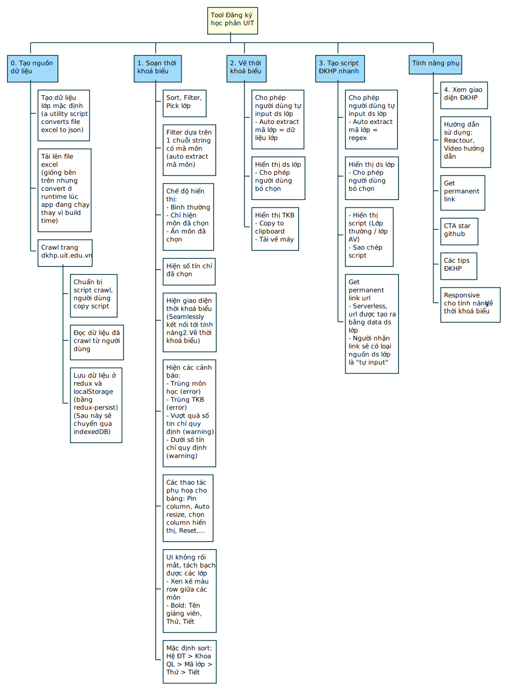

  
  <h1>Tool Đăng Ký Học Phần UIT</h1>

## Giới thiệu

Tool Đăng Ký Học Phần UIT là một ứng dụng web hỗ trợ các bạn sinh viên UIT đăng ký học phần được dễ dàng, tiện lợi. Ứng dụng gồm 2 phần chính: **1. Tool Soạn Thời Khoá Biểu** (chuẩn bị cho ĐKHP) và **2. Script Đăng Ký Học Phần** - hỗ trợ ĐKHP nhanh hơn đăng ký thủ công - được gen ra từ bước 1. Soạn thời khoá biểu.

> Trước kia, để **1. Soạn Thời Khoá Biểu** mất vài ngày, bây giờ chỉ mất vài phút, để **2. ĐKHP** mất vài phút, bây giờ chỉ mất vài giây.

## Các update ở phiên bản 2024

### Preview

Ở phiên bản mới nhất, người dùng có thể preview Thời Khoá Biểu ngay trong Grid Danh Sách Lớp bằng 1 trong 2 cách:

  
1. Sử dụng tab Preview trên Sidebar

  

  
2. Mở 2 tab browser (tiện lợi cho người có 2 màn hình)

  

### Selection Behavior

Ở phiên bản mới nhất:

  
1. Những slot bị trùng TKB sẽ không hiện checkbox (non-selectable), giúp nhanh chóng chỉ ra những lớp nào có thể chọn được

  

 

  
2. Khi chọn thừa lớp cho môn, sẽ hiện các cặp lớp thừa lên Thời Khoá Biểu

  

 

  
3. Có thể tương tác trực tiếp lên Thời Khoá Biểu: Click để xoá môn, <i>Shift+Click và Ctrl+Shift+Click cho các trường hợp đặc biệt khác</i>

Những lớp chung môn cũng sẽ hiện biểu tượng icon thùng rác khi hover để nhanh chóng nhận biết lớp nào sẽ bị xoá sau khi click.

### Filters/Columns/RowGroup

Ở phiên bản mới nhất, các filters, columns, row group configs đã được cải thiện cho mượt mà hơn và hoạt động hợp lý hơn. Các configs này sẽ hiện ở 4 nơi:

  
1. Ngay trên Header Name của column

  

 

  
2. Tab "Filters" ở Sidebar

  

 

  
3. Tab "Columns" ở Sidebar

  

 

  
4. Context Menu (khi click chuột phải lên Grid)

  

### Others

  
1. Chia sẻ TKB

Khi bấm vào nút chia sẻ TKB, các bạn sẽ được đưa đến 1 url với query param <code>https://dkhp-uit.vercel.app?self_selected={1 danh sách mã lớp}</code>. Url này có thể dùng đễ lưu lại trạng thái các lớp đã chọn, hoặc chia sẻ cho bạn bè.

<b>NOTE:</b> Thời Khoá Biểu hiển thị sẽ ưu tiên danh sách mã lớp trên url. Nếu bạn muốn hiển thị Thời Khoá Biểu theo các lớp được chọn ở local, phải xoá url query param đó đi (url query param có ưu tiên hiển thị cao hơn các lớp được chọn ở local).

  
2. Tải hình ảnh TKB về máy

  
3. Copy script

---

  
Old doc (before 2024)

## [ 👉 TODOLIST](https://github.com/loia5tqd001/Dang-Ky-Hoc-Phan-UIT/issues/20)

## Giới thiệu

Tool Đăng Ký Học Phần UIT là một ứng dụng hỗ trợ các bạn sinh viên UIT đăng ký học phần được dễ dàng, tiện lợi.

Vì sẽ có rất nhiều đối tượng sinh viên, và rất nhiều trong số đó chỉ muốn sử dụng **một số tính năng nhất định** của ứng dụng mà **không muốn sử dụng toàn bộ ứng dụng**. Do đó, các tính năng của ứng dụng đã được **tách rời**, **làm cho không phụ thuộc vào nhau**, giúp phục vụ nhiều đối tượng sinh viên nhất có thể.   Chẳng hạn, bạn master Excel, có thể tự soạn thời khoá biểu cho bản thân mình nên không cần sử dụng tính năng _<ins>Soạn thời khoá biểu</ins>_ của ứng dụng này, thì bạn vẫn có thể sử dụng tính năng _<ins>Vẽ thời khoá biểu</ins>_ để xem thời khoá biểu bạn đã soạn, hoặc sử dụng tính năng _<ins>Tạo script ĐKHP nhanh</ins>_ để tạo lợi thế ĐKHP nhờ script tự động thao tác nhanh hơn so với đăng ký học phần thủ công.

## Usecase

### Lược đồ usecase tổng quát

_So với usecase trên trường học thì «cần» ở đây là «include», «có thể giúp» là «extend»_

### Tách usecase

## Phân tích tính năng

`Input + Hành động người dùng + Hệ thống xử lý = Output`

| Tính năng                  | Input                                                 | Hành động người dùng                                                                          | Output                                                                |
| -------------------------- | ----------------------------------------------------- | --------------------------------------------------------------------------------------------- | --------------------------------------------------------------------- |
| _0._ Tạo nguồn dữ liệu     |                                                       | - Sử dụng dữ liệu mặc định   - Tải lên file excel   - Crawl từ trang dkhp.uit.edu.vn | _Dữ liệu lớp học_                                                     |
| _1._ Soạn thời khoá biểu   | _Dữ liệu lớp học_                                     | Sort, filter, pick lớp                                                                        | _Danh sách lớp học sẽ ĐK_                                             |
| _2._ Vẽ thời khoá biểu     | - _Dữ liệu lớp học_   - _Danh sách lớp học sẽ ĐK_ |                                                                                               | Giao diện thời khoá biểu   - Copy to clipboard   - Tải về máy |
| _3._ Tạo script ĐKHP nhanh | _Danh sách lớp học sẽ ĐK_                             |                                                                                               | Script ĐKHP nhanh                                                     |
| _4._ Xem giao diện ĐKHP    |                                                       |                                                                                               | Giao diện ĐKHP mẫu                                                    |

### Mối quan hệ giữa các tính năng

  
Tách tính năng <ins><i>Vẽ thời khoá biểu</i></ins>

  

  
Tách tính năng <ins><i>Tạo script ĐKHP nhanh</i></ins>

  

## Phân rã chức năng

## Cấu trúc giao diện

Giao diện gồm 5 màn hình tương ứng với 5 tính năng bên trên:

- Tính năng <ins>_Tạo nguồn dữ liệu_</ins> → Màn hình `Tạo dữ liệu`
- Tính năng <ins>_Soạn thời khoá biểu_</ins> → Màn hình `Soạn TKB`
- Tính năng <ins>_Vẽ thời khoá biểu_</ins> → Màn hình `Vẽ TKB`
- Tính năng <ins>_Tạo script ĐKHP nhanh_</ins> → Màn hình `Script ĐKHP nhanh`
- Tính năng <ins>_Xem giao diện ĐKHP_</ins> → Màn hình `Giao diện ĐKHP`

## Hướng dẫn bảo trì dự án

### Về thiết kế hệ thống, bảo trì các lược đồ (diagrams)

### Bảo trì mã nguồn

#### Cách khởi chạy dự án

#### Code convention

#### Cách chạy testcase

#### Cập nhật thời khoá biểu mặc định

