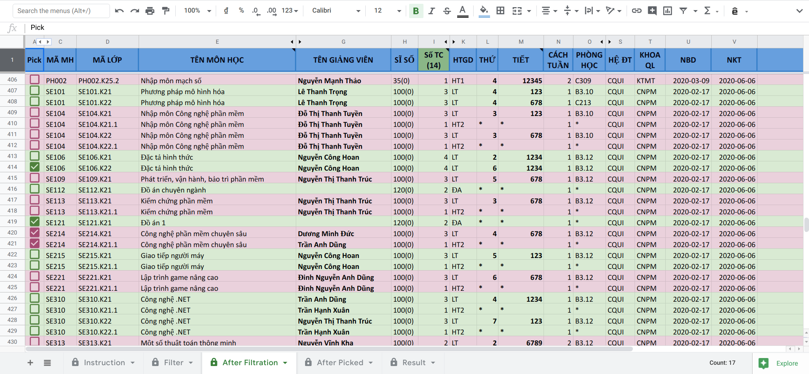
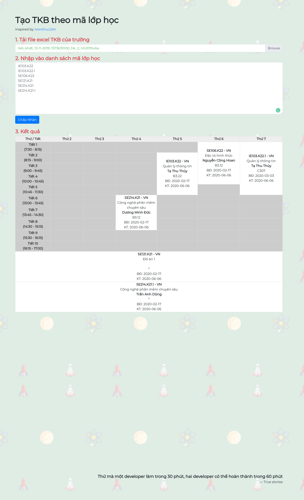
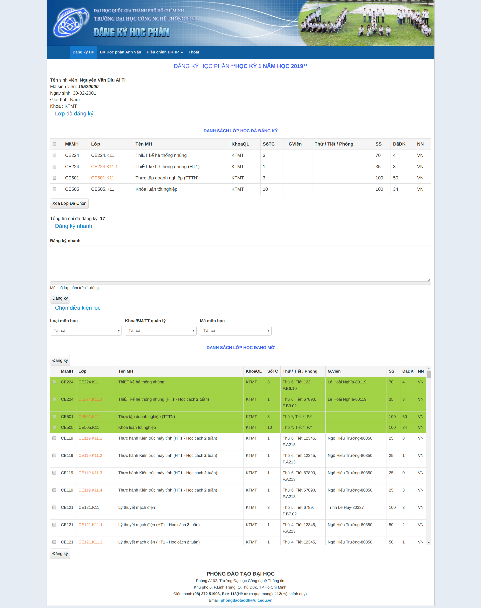

# Tool Đăng Ký Học Phần UIT

- [Xem video hướng dẫn](https://www.youtube.com/watch?v=KmW7qu52dpE)
- [Ngó sơ qua tool đăng ký học phần](https://docs.google.com/spreadsheets/d/1DtVql2fZgBr2bwzHHVePjWf8gELXi5uK_wXD8aTppTw/edit#gid=200020773)
- [**Copy tool để dùng**](http://bit.ly/dkhp-uit-helper)
- [Giao diện đkhp của trường](https://loia5tqd001.github.io/Dang-Ky-Hoc-Phan-UIT/nem-mui-dkhp/)
- [**Tạo TKB từ danh sách lớp**](https://loia5tqd001.github.io/Dang-Ky-Hoc-Phan-UIT/tao-tkb/)

Giao diện google sheets

---

## Ngó sơ qua tool

---

## Tạo TKB từ danh sách lớp

---

## Giao diện ĐKHP của trường

